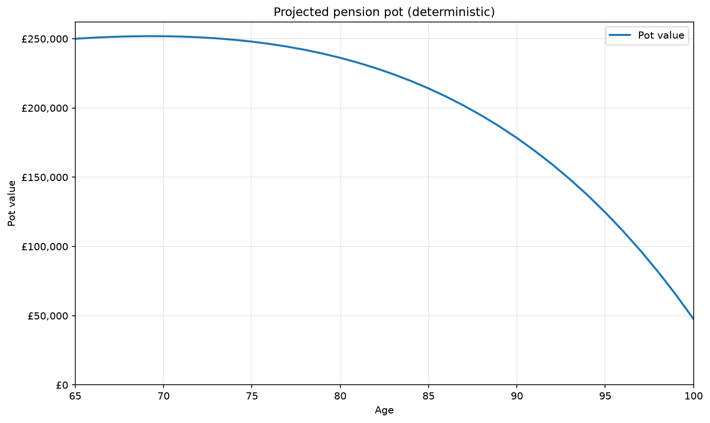
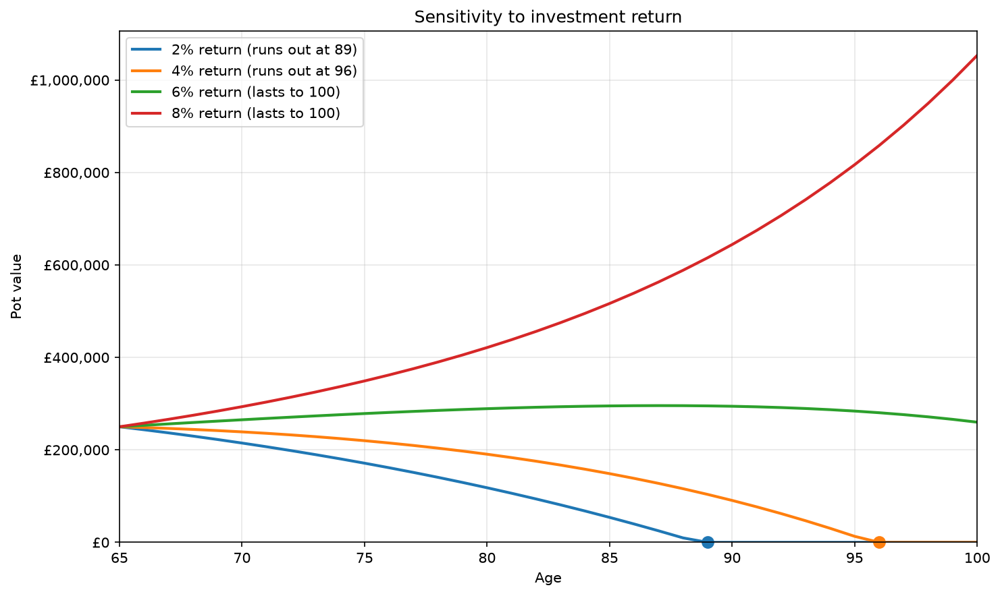
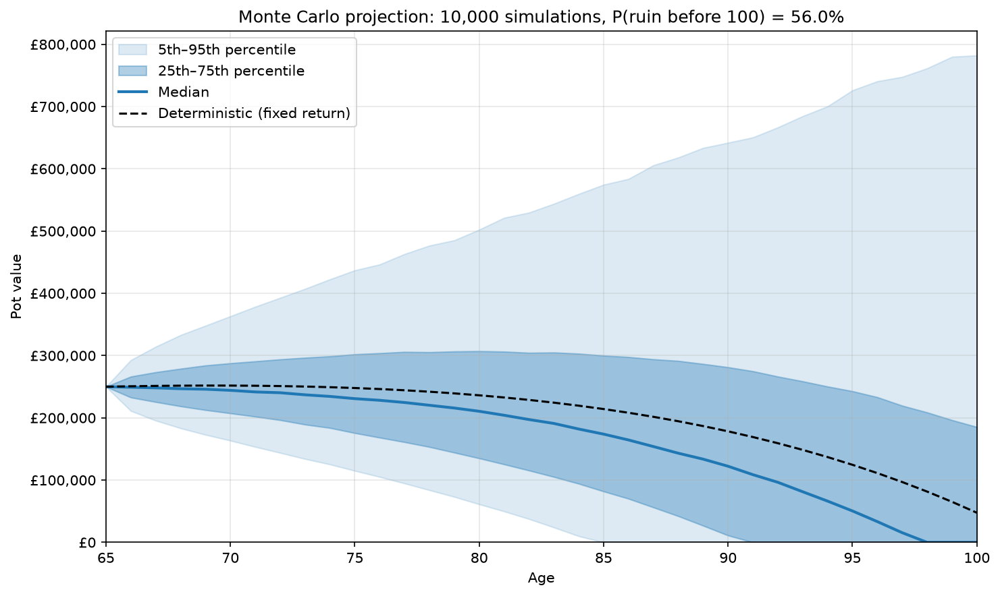
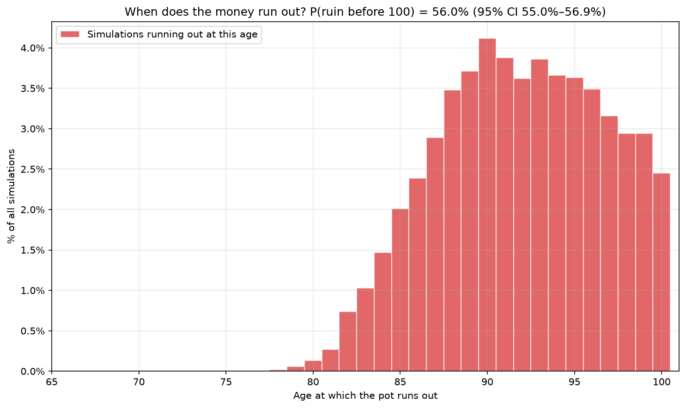
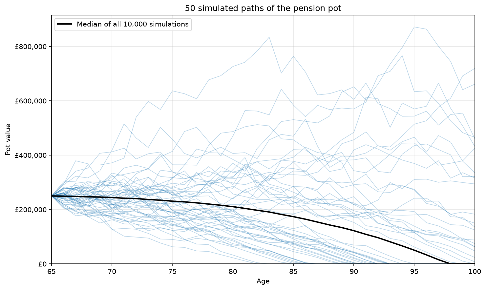

# Retirement Pot Monte Carlo Simulator

## Purpose

How likely is a retiree to run out of money, depending on their pension pot, equity returns, life expectancy and withdrawal strategy?

## Description

A stochastic retirement income model being built in distinct stages. The first stage is a simple deterministic baseline projection, which I then expanded to Stage 2 by stochastically modelling market returns using a Geometric Brownian Motion model. I then used a Monte Carlo simulation to generate a probabilistic measure of whether or not a pension would be depleted before the end of the time horizon. Next, I plotted a fan chart, graph of sample paths and histogram of at what age a pension ran out. In the later stages of this project I intend to further stochastise life span (from mortality tables), introduce correlation between inflation and market returns, and compare withdrawal strategies.

## Current state

The current version stochastically models investment returns but fixes a time horizon, inflation, fees and a withdrawal strategy to predict the probability of a pension pot depleting. The returns are modelled using a log-normal Geometric Brownian Motion model which generates Monte Carlo simulations, from which I calculated the probability of a pot depleting before the end of the time horizon.

## Deterministic results for some arbitrary assumptions

I used the following values for each factor:
- Starting pot: £250,000 at age 65
- First withdrawal: £10,000 (4% of the starting pot), rising 2.0% (for inflation) p.a.
- Annual returns: 5%
- Annual fee: 0.5%





Notice how shifting the investment return by only 2% dramatically changes how long it takes to deplete the pot!

## Now the stochastically modelled equity returns

Instead of a 5% fixed annual return, let's model it using an expected return of 5% and volatility of 10%, keeping all else the same as before.







The deterministic model projected this pension pot would last the pensioner until age 100 but our new model suggests a 56% (95% CI: 55.0–56.9% using 10,000 simulations) chance it runs out before then. It is particularly interesting to compare the median path with the deterministic path, with the median running out at age 98 and the deterministic lasting until 100. Why is this the case? This is the result of **volatility drag**. The returns are modelled log-normally and the median annual returns (4.5%) are lower than 5%, so the volatility lowers the typical outcome even when the mean does not change. This can be explained by examining the effect of a loss followed by a gain of the same magnitude, which would leave you worse off; losses require disproportionately larger percentage gains to recover. Withdrawals also compound this effect, since they are fixed and, thus, after a market downturn result in a larger proportion of the portfolio being sold at low prices. If the market rebounds, these losses are not recovered, compounding the effect.

Clearly a deterministic projection can be misleading. It looked safe in this example but failed 56% of the time in the Stage 2 simulations. In the worst 5% of outcomes, the pot ran out by age 85, a significant risk caused purely by uncertainty in market returns.

## Installation

In a terminal run (needs Python 3.10 or later):
```bash
git clone https://github.com/aroyston14/Retirement_income_Monte_Carlo_Simulator.git retirement-monte-carlo
cd retirement-monte-carlo
pip install -r requirements.txt
python run.py
python -m pytest
```

The various plots will be produced in the 'outputs' folder.

The project is tested against closed-form results and hand calculated results. The Monte Carlo tests were drafted with AI-assistance, then checked and verified by me.

## Assumptions and Limitations

The current state of the project still assumes a fixed time horizon, inflation, fees and only uses one withdrawal strategy. It also relies on a Geometric Brownian Motion model of equity returns, bringing all this model's assumptions, such as fixed volatility over time and independent returns each year. Additionally, the Stage 2 results used the time horizon 65 to 100 meaning 'ruin' means the pot runs out before age 100 rather than before death, overstating the 56% risk.

## Project Roadmap

- [x] Stage 1: Deterministic projection (fixed assumptions)
- [x] Stage 2: Stochastic equity returns (GBM) and Monte Carlo simulation
- [ ] Stage 3: Random lifetimes from mortality tables
- [ ] Stage 4: Correlated bonds and inflation, calibrated to real data
- [ ] Stage 5: Comparison of withdrawal strategies, annuity pricing

